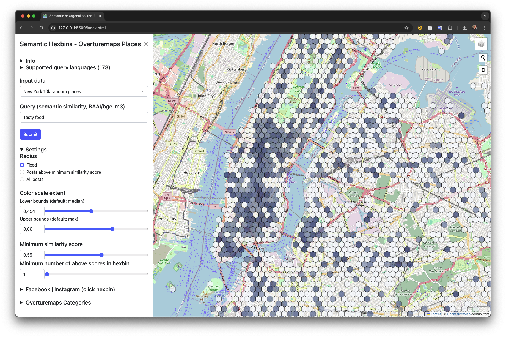

# Semantic Hexbins

## See also this demo for Bonn based on Instagram posts: https://do-me.github.io/semantic-hexbins/

A lightweight frontend app using transformers.js showcasing the use of semantic similarity for geospatial applications such as geosocial media. Data source: Overturemaps Places.

Building on previous research:

- [An Application-Oriented Implementation of Hexagonal On-the-fly Binning Metrics for City-Scale Georeferenced Social Media Data](https://isprs-archives.copernicus.org/articles/XLVIII-4-W7-2023/253/2023/)
- [Developing a Privacy-Aware Map-Based Cross-Platform Social Media Dashboard for Municipal Decision-Making](https://isprs-archives.copernicus.org/articles/XLVIII-4-W1-2022/545/2022/)

## Idea 

The paper describes an approach to use semantic similarity for geospatial purposes, like georeferenced social media data.

## Data samples

The data samples stem from Overturemaps Places. There are currently 10k, 40k and 60k random samples. As this app is thought for demo purposes only it's running entirely in your frontend! 

## Contact 
Made by Dominik Weckmüller. I'm a scientist and freelancer specialized in GIS, NLP and web applications. I’m available for freelance work, corporate & scientific collaboration. [Get in touch](https://www.linkedin.com/in/dominik-weckm%C3%BCller/)!
More details in the soon to be published paper or in this [Mascaping Episode](https://mapscaping.com/podcast/semantic-search-for-geospatial/). Also check out [SemanticFinder](https://do-me.github.io/SemanticFinder/)!

## Further ideas 
Dynamically load data from Overturemaps for an AOI of your choice and index on the fly. 